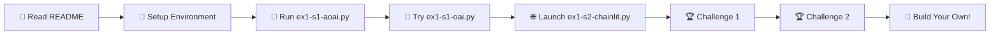

# 🤖 Exercise 1: First AI Chat Service

> **Create your first AI chat service using Azure OpenAI with different SDK approaches and learn to build interactive chat interfaces.**

<div align="center">


</div>

---

## 🎯 **Objective**

Transform from zero to hero in AI chat development! Learn to build intelligent conversational applications using Azure OpenAI through multiple approaches and create modern web interfaces.

## ✨ **What You'll Learn**

<table>
<tr>
<td width="50%">

### 🔧 **Technical Skills**
- Azure OpenAI service setup & authentication
- Different SDK approaches (Azure OpenAI vs OpenAI)
- Chat completions API mastery
- Interactive web interfaces with Chainlit
- Token management & cost optimization

</td>
<td width="50%">

### 🧠 **AI Concepts**
- Prompt engineering fundamentals
- Response handling strategies
- Conversation flow management
- Session state management
- Real-time streaming responses

</td>
</tr>
</table>

## 📋 **Prerequisites**

<details>
<summary>🔍 <strong>Click to expand requirements</strong></summary>

- ✅ Azure subscription with OpenAI access
- ✅ Azure OpenAI resource deployed with a chat model (e.g., GPT-4)
- ✅ Python environment with required packages
- ✅ Environment variables configured (`.env` file)

</details>

## 📁 **Project Structure**

```
EX1-FirstAIChat/
├── 📄 README.md                 # You are here!
├── 📂 samples/                  # Learning examples
│   ├── 🐍 ex1-s1-aoai.py       # Azure OpenAI SDK approach
│   ├── 🐍 ex1-s1-oai.py        # Standard OpenAI SDK approach  
│   ├── 🌐 ex1-s2-chainlit.py   # Interactive web interface
│   ├── 📝 chainlit.md          # Web interface config
│   └── 📂 public/              # Static assets
└── 📂 challenge/               # Practice challenges
    ├── 🏆 challenge-1-azure-openai-personal-assistant.md
    ├── 🏆 challenge-2-chainlit-learning-companion.md
    └── 📂 Solutions/            # Your solutions go here!
```

---

## 🚀 **Sample Applications**

### 1️⃣ **Azure OpenAI SDK Example** `ex1-s1-aoai.py`

<div style="background: linear-gradient(135deg, #667eea 0%, #764ba2 100%); padding: 20px; border-radius: 10px; margin: 10px 0;">

**🎯 Perfect for learning the fundamentals**

- ✨ Direct Azure OpenAI SDK usage
- 📚 Comprehensive parameter documentation  
- 📊 Token usage tracking & analysis
- 🛡️ Error handling best practices
- 💬 Single-turn conversation example

</div>

### 2️⃣ **Standard OpenAI SDK Example** `ex1-s1-oai.py`

<div style="background: linear-gradient(135deg, #f093fb 0%, #f5576c 100%); padding: 20px; border-radius: 10px; margin: 10px 0;">

**🔄 Alternative SDK approach**

- 🔗 Standard OpenAI SDK with Azure endpoints
- 🤝 Familiar OpenAI SDK patterns
- ⚖️ Direct comparison with Azure-specific SDK
- 🎛️ Flexible authentication approach

</div>

### 3️⃣ **Interactive Chainlit Interface** `ex1-s2-chainlit.py`

<div style="background: linear-gradient(135deg, #4facfe 0%, #00f2fe 100%); padding: 20px; border-radius: 10px; margin: 10px 0;">

**🌐 Modern web-based chat experience**

- ⚡ Real-time streaming responses
- 💾 Conversation history management
- 👥 Multi-user session support
- 🎨 Professional chat UI
- 🏗️ Event-driven architecture

</div>

---

## 🏆 **Challenges**

<div align="center">

### 🥇 **Challenge 1: Personal Assistant with Context Memory**
*Build an intelligent assistant using Azure OpenAI SDK*

| Difficulty | Time | Features |
|------------|------|----------|
| 🟢 **Beginner** | 10-15 min | Interactive loop, name memory, basic personalization |
| 🟡 **Advanced** | +5 min | Question counting, help commands, conversation summary |

---

### 🥈 **Challenge 2: AI-Powered Chat with Chainlit**  
*Create an adaptive web chat with user memory*

| Difficulty | Time | Features |
|------------|------|----------|
| 🟢 **Beginner** | 10-15 min | Name collection, session memory, personalized responses |
| 🟡 **Advanced** | +5 min | Info commands, message stats, enhanced UX |

</div>

---

## 🚦 **Getting Started**

### **Step 1: Environment Setup** 
```bash
pip install -r requirements.txt
```

### **Step 2: Configure Your Secrets**
Create a `.env` file:
```bash
AZURE_OPENAI_ENDPOINT=your_endpoint_here
AZURE_OPENAI_API_KEY=your_api_key_here  
AZURE_OPENAI_DEPLOYMENT_NAME=your_deployment_name
AZURE_OPENAI_API_VERSION=2024-08-01-preview
```

### **Step 3: Run the Examples**

<table>
<tr>
<td width="33%">

**🔹 Basic Azure OpenAI**
```bash
python samples/ex1-s1-aoai.py
```

</td>
<td width="33%">

**🔹 Standard OpenAI SDK**
```bash
python samples/ex1-s1-oai.py
```

</td>
<td width="33%">

**🔹 Interactive Chainlit**
```bash
chainlit run samples/ex1-s2-chainlit.py
```

</td>
</tr>
</table>

### **Step 4: Complete the Challenges** 🎯
- Start with **Challenge 1** for Azure OpenAI SDK practice
- Move to **Challenge 2** for Chainlit and advanced features
- Save your solutions as `ex1-ch1-YOURNAME.py` and `ex1-ch2-YOURNAME.py`

---

## 🛤️ **Learning Path**



## 💡 **Key Concepts Covered**

<div style="display: grid; grid-template-columns: 1fr 1fr; gap: 20px; margin: 20px 0;">

<div style="background: #f8f9fa; padding: 15px; border-radius: 8px; border-left: 4px solid #007bff;">

**🔐 Authentication**
- Azure OpenAI client setup
- API key management
- Environment configuration

</div>

<div style="background: #f8f9fa; padding: 15px; border-radius: 8px; border-left: 4px solid #28a745;">

**💬 Chat Completions**  
- Message roles and structure
- Conversation flow design
- Response formatting

</div>

<div style="background: #f8f9fa; padding: 15px; border-radius: 8px; border-left: 4px solid #ffc107;">

**⚙️ Parameters**
- Temperature, tokens, penalties
- Model behavior tuning
- Cost optimization

</div>

<div style="background: #f8f9fa; padding: 15px; border-radius: 8px; border-left: 4px solid #dc3545;">

**🌊 Streaming**
- Real-time response delivery
- Enhanced user experience
- Progressive content loading

</div>

</div>

---

<div align="center">

## 🎉 **Ready to Start Your AI Journey?**

*This exercise provides a comprehensive foundation for building AI-powered chat applications!*

**💫 Go ahead and dive in - the future of conversational AI awaits! 💫**

---

📚 **Need Help?** Check the sample code comments and challenge hints!  
🐛 **Found an Issue?** The Solutions folder has working examples!  
🚀 **Want More?** Complete both challenges and experiment with different parameters!

</div>
