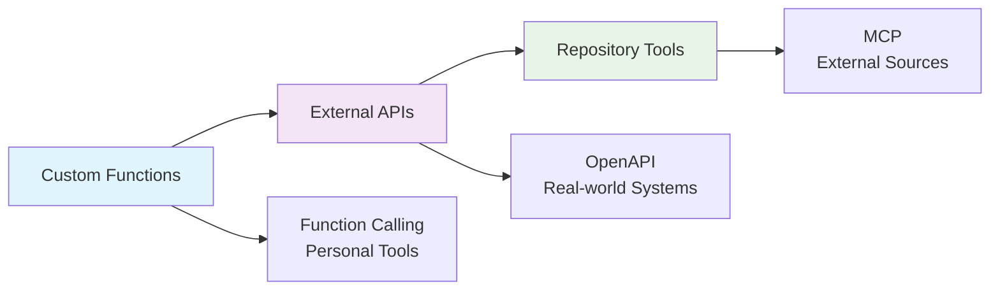

# 🔧 Exercise 3: Agent with Tools

<div align="center">


### **Master AI Ag## 📚 **Additional Resources**

### **📖 Documentation**
- [Azure AI Foundry Agent SDK](https://docs.microsoft.com/azure/ai-foundry/)
- [Function Calling Best Practices](https://docs.microsoft.com/azure/ai/function-calling/)
- [OpenAPI Specification Guide](https://swagger.io/specification/)
- [Model Context Protocol (MCP)](https://modelcontextprotocol.io/)

### **🛠️ Tools & Libraries**
- [Azure AI Projects SDK](https://pypi.org/project/azure-ai-projects/)
- [Azure Identity](https://pypi.org/project/azure-identity/)
- [OpenAPI Generator](https://openapi-generator.tech/)
- [MCP Servers](https://github.com/modelcontextprotocol/)

### **🎓 Learning Path**
1. ✅ Complete EX1: Basic AI Chat
2. ✅ Complete EX2: Agent Service
3. **✅ Complete EX3: Agent Tools** ← *You are here*
4. 🚀 Continue to EX4: Agent Orchestration Service
5. 🎯 Advance to EX5: Semantic Kernel Integrationon for Industrial Applications**

*Enhance your agents with powerful tools for knowledge retrieval, code execution, and external API integration*

</div>

---

## 🎯 **Learning Objectives**

By completing this exercise, you will:

- **🔍 Master File Search**: Implement knowledge retrieval with vector stores
- **💻 Harness Code Interpreter**: Execute Python code for data analysis  
- **🌐 Integrate APIs**: Connect agents to external systems via OpenAPI
- **🏭 Apply Industrial Context**: Build tools for manufacturing environments
- **🔄 Understand Tool Progression**: From knowledge to action tools

---

## 🛠️ **Tool Types Overview**

### **⚙️ Custom Function Tools**
> *Create personalized functions tailored to your specific needs*

- **Custom Function Integration**: Build your own specialized functions
- **Multi-Parameter Support**: Handle complex inputs and validations
- **JSON Response Formatting**: Structured outputs for consistent processing
- **Use Cases**: Weather services, password generation, task management, time utilities

### **🌐 External API Tools - OpenAPI**
> *Connect agents to real-world systems and enterprise applications*

- **REST API Integration**: Full CRUD operations on external systems
- **Schema Validation**: Automatic request/response validation
- **Real-time Data Access**: Live inventory, maintenance, and operational data
- **Use Cases**: ERP integration, inventory management, system automation

### **🔗 Model Context Protocol (MCP)**
> *Extend agents with external tools and data sources*

- **Repository Integration**: Connect to GitHub and other code repositories
- **Documentation Analysis**: Automated code and documentation review
- **Multi-Source Data**: Combine information from various external sources
- **Use Cases**: Code analysis, documentation search, development automation

---

## 📁 **Project Structure**

```
EX3-AgentWithTools/
├── README.md                                 # This file
├── samples/                                  # Sample implementations
│   ├── ex3-s1-FunctionCalling.py           # Custom Function Calling
│   ├── ex3-s2-AgentWithOpenAPI.py          # OpenAPI integration
│   ├── ex3-s3-AgentWithMCP.py              # Model Context Protocol
│   └── files/                               # Sample data files
│       └── nifty_500_quarterly_results.csv # Financial data sample
└── challenge/                               # Hands-on exercises
    ├── ex3-ch1-FunctionCalling.md          # Multi-Function Agent Challenge
    ├── ex3-ch2-OpenAPI.md                  # Real-World API Integration
    └── ex3-ch3-MCP.md                      # External Tools with MCP
```

---

## 🚀 **Quick Start Guide**

### **Prerequisites**
- ✅ Completed [EX1-FirstAIChat](../EX1-FirstAIChat) and [EX2-FirstAgent](../EX2-FirstAgent)
- ✅ Azure AI Foundry project configured
- ✅ Python environment with required packages
- ✅ Authentication method configured (AAD or Service Principal)

### **Installation**
```bash
# Install required packages for all samples and challenges
pip install azure-ai-projects azure-identity python-dotenv

# Additional packages for advanced challenges
pip install json datetime typing random string

# Configure environment variables
cp .env.example .env
# Edit .env with your Azure AI Foundry details
```

### **Environment Variables**
```bash
# Required for all samples and challenges
AI_FOUNDRY_ENDPOINT=your_azure_ai_foundry_endpoint
AI_FOUNDRY_DEPLOYMENT_NAME=your_model_deployment_name

# Optional: For advanced MCP authentication
GITHUB_TOKEN=your_github_personal_access_token
AZURE_TENANT_ID=your_tenant_id
AZURE_CLIENT_ID=your_client_id
AZURE_CLIENT_SECRET=your_client_secret
```

---

## 📖 **Sample Explanations**

### **⚙️ Sample 1: Function Calling Agent**
> *Multi-Function Personal Assistant*

**Files**: `ex3-s1-FunctionCalling.py`

**Key Features**:
- Custom function definition and registration
- Multiple function handling in single conversations
- Weather data retrieval with mock services
- JSON-formatted responses for structured data

**Learning Concepts**:
- Function calling architecture fundamentals
- Parameter handling and validation
- Tool definition and registration
- Multi-function workflow management

**Demo Flow**:
1. Defines custom weather function with parameters
2. Registers function with AI agent
3. Handles function calls and approvals
4. Demonstrates interactive conversations with tools

### **🌐 Sample 2: OpenAPI Integration Agent**
> *Real-World Inventory Management System*

**Files**: `ex3-s2-AgentWithOpenAPI.py`

**Key Features**:
- Complete OpenAPI specification integration
- Real-time inventory data access
- CRUD operations on inventory systems
- Industrial spare parts management

**Learning Concepts**:
- OpenAPI specification usage
- External API authentication
- Real-world data integration
- Business process automation

**Demo Flow**:
1. Loads OpenAPI specification for inventory API
2. Connects to real inventory management system
3. Demonstrates search, filtering, and data retrieval
4. Interactive inventory management session

### **🔗 Sample 3: Model Context Protocol Agent**
> *External Repository Integration*

**Files**: `ex3-s3-AgentWithMCP.py`

**Key Features**:
- GitHub repository integration via MCP
- Documentation and code analysis
- Multi-repository comparison capabilities
- Tool approval and security workflows

**Learning Concepts**:
- Model Context Protocol fundamentals
- External tool integration patterns
- Repository analysis and documentation search
- Security and approval mechanisms

**Demo Flow**:
1. Connects to GitHub repositories using MCP
2. Analyzes repository structure and documentation
3. Demonstrates tool approval workflows
4. Interactive code and documentation exploration

---

## 🎯 **Hands-On Challenges**

Ready to put your learning into practice? Each challenge builds on the sample code and guides you through creating increasingly sophisticated AI agents.

### **�️ Challenge 1: Multi-Function Agent Assistant** 
[](challenge/ex3-ch1-FunctionCalling.md) 
[](challenge/ex3-ch1-FunctionCalling.md)

**Based on**: `ex3-s1-FunctionCalling.py`

Transform the basic weather example into a comprehensive personal assistant with multiple custom functions:

- 🌤️ **Enhanced Weather Function**: Multi-city support with detailed forecasts
- ⏰ **Time Zone Function**: Global time queries with timezone support  
- �🔐 **Password Generator**: Secure password creation with customizable options
- 📝 **Task Manager**: Add, list, and complete tasks (Advanced level)
- 🎲 **Random Content**: Jokes, facts, and entertainment (Advanced level)

**Perfect for**: Learning function calling fundamentals and building practical utilities

[**Start Challenge 1 →**](challenge/ex3-ch1-FunctionCalling.md)

---

### **🌐 Challenge 2: Real-World Inventory Management** 
[](challenge/ex3-ch2-OpenAPI.md) 
[](challenge/ex3-ch2-OpenAPI.md)

**Based on**: `ex3-s2-AgentWithOpenAPI.py`

Connect to a real IBM inventory API and create a practical inventory management assistant:

- 📦 **Real API Integration**: Connect to live inventory data at `ibm-aiclass-apim.azure-api.net`
- 🔍 **Smart Search**: Find parts by category, characteristics, and stock levels
- 📊 **Inventory Insights**: Generate low stock alerts and summaries
- 🎛️ **Interactive Workflows**: Multi-step inventory management processes (Advanced level)

**Perfect for**: Learning OpenAPI integration with real-world business applications

[**Start Challenge 2 →**](challenge/ex3-ch2-OpenAPI.md)

---

### **🔗 Challenge 3: External Tools with MCP** 
[](challenge/ex3-ch3-MCP.md) 
[](challenge/ex3-ch3-MCP.md)

**Based on**: `ex3-s3-AgentWithMCP.py`

Master Model Context Protocol by connecting your agent to external tools and repositories:

- 📊 **GitHub Integration**: Analyze repositories, documentation, and code structure
- 🔍 **Multi-Source Analysis**: Compare different projects and frameworks
- ⚙️ **Tool Approval Workflows**: Understand security and authentication patterns
- 🎯 **Advanced Queries**: Complex multi-step analysis across repositories (Advanced level)

**Perfect for**: Understanding external tool integration and expanding agent capabilities

[**Start Challenge 3 →**](challenge/ex3-ch3-MCP.md)

---

## 🎨 **Tool Integration Patterns**

### **🎯 Azure Default Credential (AAD)**
> *Recommended for development environments*

**Files**: `*-aad.py`

**Benefits**:
- Seamless integration with Azure CLI and VS Code
- No credential management required locally
- Perfect for development and testing

**Setup**:
```bash
# Login via Azure CLI
az login

# Or use VS Code Azure extension
# Extension will handle authentication automatically
```

### **🔑 Service Principal (SP)**  
> *Recommended for production environments*

**Files**: `*-sp.py`

**Benefits**:
- Non-interactive authentication
- Fine-grained access control
- Ideal for CI/CD pipelines and production

**Setup**:
1. Create service principal in Azure AD
2. Assign appropriate roles and permissions
3. Configure environment variables with credentials

---

## 🎨 **Tool Integration Patterns**

### **📋 Progressive Tool Usage**



### **🔄 Tool Combination Strategies**

**Sequential Processing**:
1. **Function Calling** → Build custom utilities and helpers
2. **OpenAPI Integration** → Connect to business systems  
3. **MCP Tools** → Integrate external data sources

**Parallel Processing**:
- **Function Calling** + **OpenAPI** → Enhanced business workflows
- **OpenAPI** + **MCP** → Rich data-driven applications
- **All Three** → Comprehensive AI assistant platforms

---

## 🏭 **Real-World Applications**

### **🔧 Business Operations**
- **Customer Service**: Function calling + API integration for support workflows
- **Data Analysis**: Custom functions + external APIs for reporting
- **Project Management**: Task functions + repository integration for development

### **📊 Technical Solutions**
- **DevOps Automation**: Repository analysis + API integration for CI/CD
- **System Monitoring**: Custom utilities + external service integration
- **Documentation**: Repository tools + content generation functions

### **🛡️ Integration Patterns**
- **Microservices**: Function calling for service coordination
- **API Gateway**: OpenAPI integration for service orchestration
- **External Tools**: MCP for third-party system integration

---

## 🎯 **Best Practices**

### **⚙️ Function Calling Optimization**
- Use clear, descriptive function names and docstrings
- Implement proper parameter validation and type hints
- Return structured JSON for consistent processing
- Handle edge cases and error conditions gracefully

### **🌐 OpenAPI Integration**
- Maintain up-to-date API specifications
- Implement proper authentication and security
- Use error handling and retry mechanisms
- Monitor API usage and rate limits

### **🔗 MCP Integration**
- Configure appropriate tool permissions and access
- Implement security best practices for external connections
- Use caching strategies for frequently accessed data
- Monitor external service availability and performance

---

## 🔧 **Troubleshooting**

### **Common Issues**

**⚙️ Function Calling Problems**:
- ❌ Function not being called → Check function docstring format and registration
- ❌ Parameter errors → Verify type hints and parameter names match
- ❌ JSON parsing errors → Use `json.dumps()` for all function returns

**🌐 OpenAPI Integration Issues**:
- ❌ API connection fails → Verify endpoint URL and authentication
- ❌ Schema validation errors → Check request format matches API spec
- ❌ Rate limiting → Implement proper throttling and retry logic

**🔗 MCP Connection Problems**:
- ❌ Repository access denied → Check URL format and authentication tokens
- ❌ Tool approval failures → Verify approval workflow implementation
- ❌ No tool responses → Check `allowed_tools` configuration

### **🔧 Debug Commands**
```bash
# Test Azure authentication
python -c "from azure.identity import DefaultAzureCredential; print('Auth OK:', DefaultAzureCredential().get_token('https://management.azure.com/.default'))"

# Validate environment setup
python -c "import os; print('Endpoint:', os.getenv('AI_FOUNDRY_ENDPOINT')); print('Model:', os.getenv('AI_FOUNDRY_DEPLOYMENT_NAME'))"

# Check Python packages
python -c "import azure.ai.projects; print('Azure AI Projects SDK installed successfully')"
```

---

## 📚 **Additional Resources**

### **📖 Documentation**
- [Azure AI Foundry Tools Documentation](https://docs.microsoft.com/azure/ai-foundry/)
- [OpenAPI Specification Guide](https://swagger.io/specification/)
- [Vector Store Best Practices](https://docs.microsoft.com/azure/search/)

### **🛠️ Tools & Libraries**
- [Azure AI Projects SDK](https://pypi.org/project/azure-ai-projects/)
- [Azure Identity](https://pypi.org/project/azure-identity/)
- [OpenAPI Tools](https://openapi-generator.tech/)

### **🎓 Learning Path**
1. Complete EX1: Basic AI Chat
2. Complete EX2: Agent Service
3. **Complete EX3: Agent Tools** ← *You are here*
4. Continue to EX4: Agent Orchestration
5. Advance to EX5: Agent Orchestration with Semantic Kernel

---

## 🎉 **Next Steps**

Ready to advance your agent capabilities? Here's your learning progression:

### **🏆 You've Completed**
- ✅ **Basic AI Chat** (EX1) - Foundation concepts
- ✅ **Agent Services** (EX2) - Agent architecture  
- ✅ **Agent Tools** (EX3) - Tool integration ← *You are here*

### **🚀 What's Next**
- **🔍 [EX4: Agent Orchestration Service](../EX4-AgentOrchestrationService)** - Multi-agent coordination
- **🧠 [EX5: Semantic Kernel Integration](../EX5-AgentOrchestrationSemanticKernel)** - Enterprise orchestration
- **🎯 Advanced Topics** - Production deployment and scaling

### **💡 Keep Learning**
- Experiment with different tool combinations
- Try the bonus challenges for advanced scenarios
- Build your own custom functions and integrations
- Share your creations with the community!

---

<div align="center">

### **🚀 Ready to Build Industrial AI Agents with Advanced Tools?**

**Choose your learning path and start building!**

[](samples/ex3-s1-FunctionCalling.py)
[](samples/ex3-s2-AgentWithOpenAPI.py)
[](samples/ex3-s3-AgentWithMCP.py)

**Or jump straight into the hands-on challenges:**

[](challenge/ex3-ch1-FunctionCalling.md)
[](challenge/ex3-ch2-OpenAPI.md)
[](challenge/ex3-ch3-MCP.md)

</div>

---

<div align="center">
<sub>Built with ❤️ for the IBM AI Masterclass | Empowering Industrial AI Innovation</sub>
</div> 